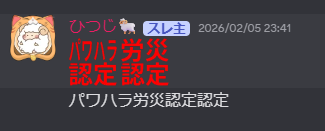
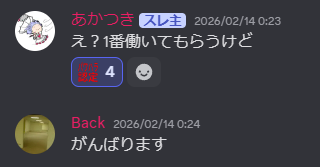

# プロダクト名 
<!-- プロダクト名に変更してください -->

<!-- プロダクト名・イメージ画像を差し変えてください -->

## チーム名
チーム27 労働基準法
<!-- チームIDとチーム名を入力してください -->

## 背景・課題・解決されること

### 背景
我が名古屋工業大学公認サークルC0deではパワハラが横行している。それだけではないカラオケ開発、エナドリ爆買い、深夜の方がレスがはやいなど非常に不健全である。きっとほかのサークルも同じようなものだ、そうに違いない。またゲームもほどんどが指先と視覚で楽しむものであり、インタラクティブなゲームは少ないのが現状である。

### 課題
- ストレスを抱えたエンジニアの増加
- 声を出しながらできる娯楽が少ない
- インタラクティブなゲームが少ない

### 解決されること
プレイヤーが発した言葉そのものを物理的なオブジェクトとしてゲーム世界に出現させることで、「声を出すこと」が直接ゲーム攻略に影響する仕組みを構築した。
これにより、感情の発散・ゲーム性を一体化し、「声を出すこと自体が楽しい体験」を提供する。

## プロダクト説明

本プロダクトは、プレイヤーの発した言葉（例：「熱い」「重い」など）が文字オブジェクトとして飛び出し、物理的な性質を持ってフィールドに影響を与えるローポリ謎解きアクションゲームである。

文字オブジェクトは内容に応じた特性を持ち、障害物を動かしたり、ギミックを作動させたりすることでステージを攻略していく。
単なる音声入力ではなく、「言葉の意味」と「物理挙動」を結びつけた点が特徴である。

## 操作説明・デモ動画
[デモ動画はこちら](https://www.youtube.com/watch?v=fbzGp0XJGq8)
<!-- 開発したプロダクトの操作説明について入力してください。また、操作説明デモ動画があれば、埋め込みやリンクを記載してください -->

## 注力したポイント

<!-- 開発したプロダクトの中で、特に注力して作成した箇所・ポイントについて入力してください -->
### アイデア面

### デザイン面

### その他

## 使用技術

<!-- 使用技術を入力してください -->

<!--
markdownの記法はこちらを参照してください！
https://docs.github.com/ja/get-started/writing-on-github/getting-started-with-writing-and-formatting-on-github/basic-writing-and-formatting-syntax
-->