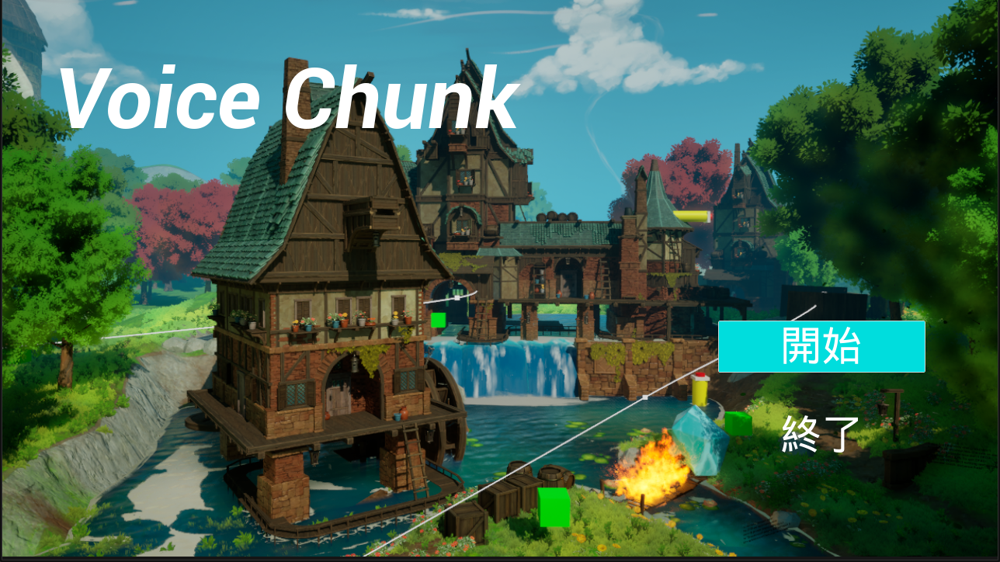
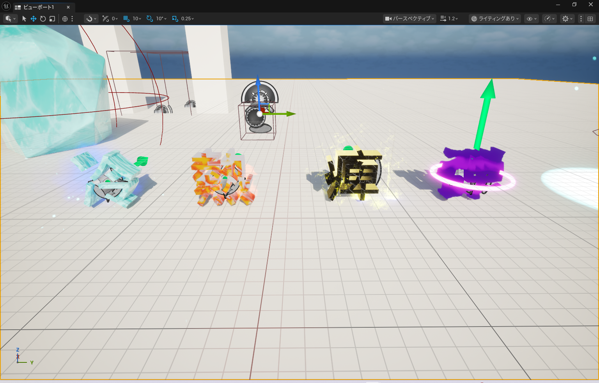
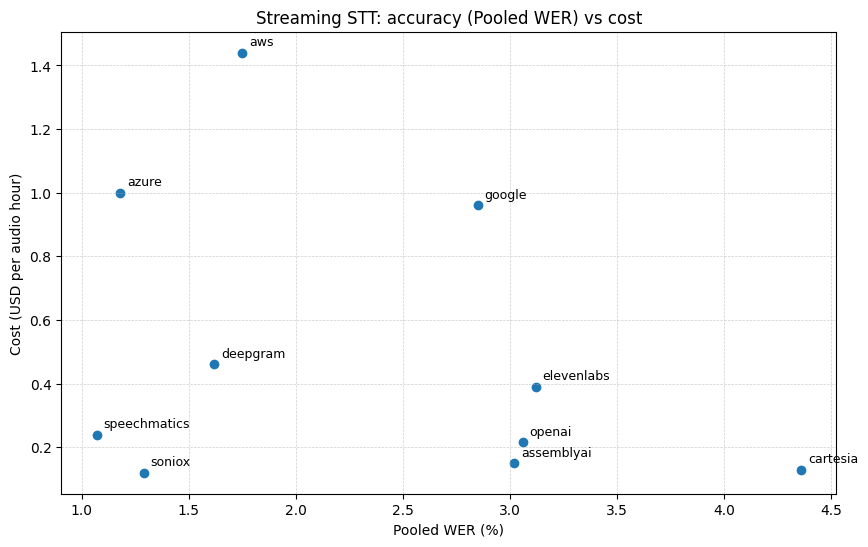

# Voice Chunk 

## チーム名
チーム27 労働基準法

## 背景・課題・解決されること

### 背景
我が名古屋工業大学公認サークルC0deではパワハラが横行している。それだけではないカラオケ開発、エナドリ爆買い、深夜の方がレスがはやいなど非常に不健全である。きっとほかのサークルも同じようなものだ、そうに違いない。またゲームもほどんどが指先と視覚で楽しむものであり、インタラクティブなゲームは少ないのが現状である。

### 課題
- ストレスを抱えたエンジニアの増加
- 声を出しながらできる娯楽が少ない
- インタラクティブなゲームが少ない

### 解決されること
プレイヤーが発した言葉そのものを物理的なオブジェクトとしてゲーム世界に出現させることで、「声を出すこと」が直接ゲーム攻略に影響する仕組みを構築した。
これにより、感情の発散・ゲーム性を一体化し、「声を出すこと自体が楽しい体験」を提供する。

## プロダクト説明

本プロダクトは、プレイヤーの発した言葉（例：「熱い」「重い」など）が文字オブジェクトとして飛び出し、物理的な性質を持ってフィールドに影響を与えるローポリ謎解きアクションゲームである。

文字オブジェクトは内容に応じた特性を持ち、障害物を動かしたり、ギミックを作動させたりすることでステージを攻略していく。
単なる音声入力ではなく、「言葉の意味」と「物理挙動」を結びつけた点が特徴である。

## 操作説明・デモ動画
[デモ動画はこちら](https://youtu.be/W_8XCaeX7kc)

## 注力したポイント

<!-- 開発したプロダクトの中で、特に注力して作成した箇所・ポイントについて入力してください -->
### アイデア面
声を具現化し、その内容に応じて属性を付与するというアイデアを最初に着想した。しかし、音声認識をリアルタイムで安定して処理することは技術的な難易度が高く、反射神経や操作速度が求められるアクションゲームにそのまま採用することには不安があった。
そこで本作では、ゲームジャンルをなぞ解き中心の構成とすることで、プレイヤーが「何を話すか」を考える時間を確保し、音声入力をゲーム体験の一部として自然に組み込んだ。これにより、音声認識の制約を弱点ではなく、思考型ゲームの特性として活かす設計とした。
### デザイン面
発した言葉に合わせて文字が属性を帯びたという事を視覚的に分かりやすく表現するため、文字オブジェクトのマテリアルやエフェクトを工夫した。以下に例を示す。冷たい属性を帯びたオブジェクトは氷の質感と冷気を発し、熱い属性を持つオブジェクトは炎のエフェクトを持たせているなど、それぞれ特徴的な見た目になるように作成した。

また、UI面では直感的に操作できるようにボタンは最小限に抑え、シンプルな画面になるよう、また派手な見た目であるべきところは派手になるように設計した。

喋る内容として日常的な日本語だけでなく、ゲームや中二病的なカタカナ造語（「エターナルフォースブリザード」「フレイムバースト」等）も想定し、日本語特化の埋め込みモデル（ruri-v3-30m）をSetFitで属性分類タスクにfine-tuningした。語幹変化への汎化（フリーズ→フリージング→フローズン等）や、複合語中の中立的な接尾辞（ブラスト、ストライク等）の分類を行う際にデフォルトのモデルでは分類能力が低下していたため、属性の偏りが生じないよう反事実データ拡張を行い、語幹変化の汎化率を39.5%→88.1%、未知造語の分類精度を55.9%→64.7%に向上させた。

### その他
STTにはリアルタイム性を重視し、WebSocketベースのストリーミング対応モデルを採用した。コストと精度のバランス、発話終了の終端検知の安定性、日本語認識精度を比較検討した結果、Deepgram Nova-3を選定した。

また、fine-tuningしたモデルはHugging Face Hubにホストし、基本的な属性分類のテストケースを最新モデルをHagging Face Hubから取得し、推論をCIで自動実行することで、モデル更新時の動作安定性を担保している。

## 使用技術
- Unreal Engine 5.6.1
- Node.js (TypeScript)
- Docker
- ngrok
- Hugging Face Hub
- Python (Transformers, SetFit)
- Deepgram (Nova-3)

[スライドはこちら](https://www.canva.com/design/DAHBxOFPETY/AYZBEqAU2obObIyGET4GpA/view?utm_content=DAHBxOFPETY&utm_campaign=designshare&utm_medium=link2&utm_source=uniquelinks&utlId=h39af16e069)

<!--
markdownの記法はこちらを参照してください！
https://docs.github.com/ja/get-started/writing-on-github/getting-started-with-writing-and-formatting-on-github/basic-writing-and-formatting-syntax
-->
